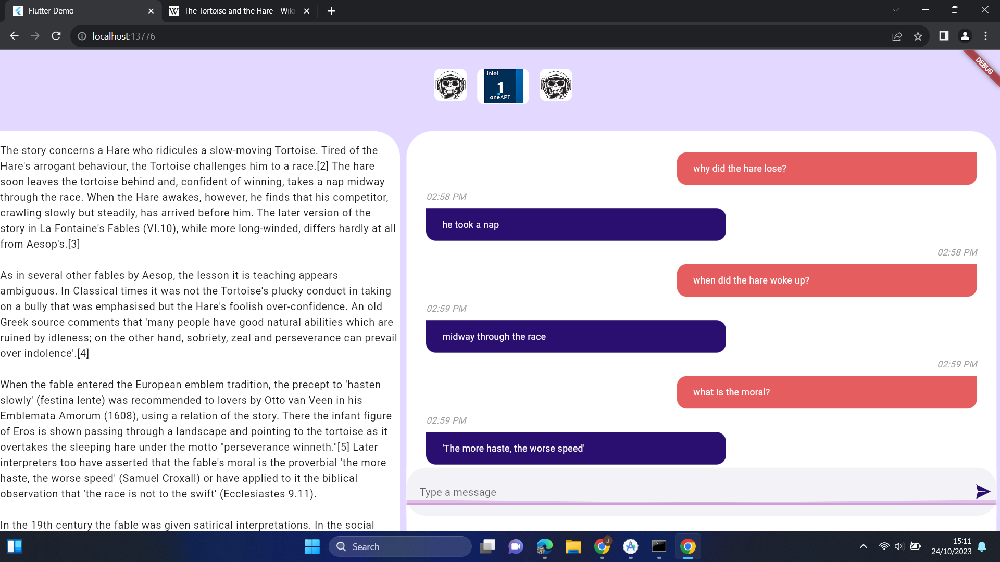

# mh_one_api


<hr>


MachineHack | Intel® oneAPI Hackathon 2023 -

[](https://codespaces.new/redR0b0t/mh_one_api)
[](https://star-history.com/#redR0b0t/mh_one_api)

# About oneAPI:

oneAPI is an open, cross-industry, standards-based, unified, multi-architecture, multi-vendor programming model that delivers a common developer experience across accelerator architectures – for faster application performance, more productivity, and greater innovation. The oneAPI initiative encourages collaboration on the oneAPI specification and compatible oneAPI implementations across the ecosystem.

 
# Problem statement
While text-based tasks are present everywhere, one of the most compelling objectives is the development of a question-answering system tailored to textual data. Imagine a system capable of sifting through vast datasets, identifying 'span_start' and 'span_end' positions within the 'Story' text, extracting the relevant 'span_text,' and generating responses that align perfectly with the provided 'Answer' for each question.


# Detailed Architecture Flow:


# Technology Stack:

- [Intel® oneAPI AI Analytics Toolkit](https://www.intel.com/content/www/us/en/developer/tools/oneapi/ai-analytics-toolkit-download.html) Tech Stack

  


# Step-by-Step Code Execution Instructions:


- Clone the Repository

```bash
 $ git clone https://github.com/redR0b0t/mh_one_api
 $ cd mh_one_api
```

- Train/Fine-tune the flan-t5-xl model on intel dev cloud.


```bash
#!/bin/bash

echo "----------checking if gpu available on current job-----------------"
# setting oneapi env and checking gpu
conda init bash
echo "-------------------------------------------"
groups  # Key group is render, PVC access is unavailable if you do not have render group present.
source /opt/intel/oneapi/setvars.sh --force
sycl-ls
export num_gpu="$(sycl-ls |grep "GPU" |wc -l)"
echo "num_gpu=$num_gpu\n"
export num_cpu="$(sycl-ls |grep "Xeon" |wc -l)"
echo "num_cpu=$num_cpu\n"
if [ $num_gpu == 0 && $num_cpu == 1] 
then 
    echo "---GPU not available exiting--------"
    scancel $SLURM_JOB_ID
fi 
echo "-------------------------------------------"


echo "starting fine tuning model"
cd "/home/u131168/mh_one_api/model/ft_model_pp/itp" # modify the directory path to the location of the repo on system
pip install -r "requirements.txt"

# To use ccl as the distributed backend in distributed training on CPU requires to install below requirement.
python -m pip install oneccl_bind_pt -f https://developer.intel.com/ipex-whl-stable-cpu

#installing intel extension for pytorch for GPU
python -m pip install torch==2.0.1a0 torchvision==0.15.2a0 intel_extension_for_pytorch==2.0.110+xpu -f https://developer.intel.com/ipex-whl-stable-xpu

# installing intel extension for transformers
pip install intel-extension-for-transformers


export train_file="/home/u131168/mh_one_api/data/f_traind_v1.csv" # modify the directory path to the location of the repo on system

export model_path="google/flan-t5-xl"

export checkpoint_dir="/home/u131168/mh_one_api/model/ft_models/flan-t5-xl_peft_ft_v2/"
export checkpoint_name=$(ls $checkpoint_dir | grep checkpoint | tail -2 | head -n 1)
export checkpoint_path="$checkpoint_dir$checkpoint_name"
echo $checkpoint_path

# export output_dir="/home/u131168/mh_one_api/model/ft_models/flan-t5-xl_peft_ft_v1"
export output_dir="$checkpoint_dir"


python finetune_seq2seq.py \
        --model_name_or_path $model_path \
        --resume_from_checkpoint $checkpoint_path \
        --bf16 True \
        --train_file $train_file \
        --per_device_train_batch_size 2 \
        --per_device_eval_batch_size 2 \
        --gradient_accumulation_steps 1 \
        --do_train \
        --learning_rate 1.0e-5 \
        --warmup_ratio 0.03 \
        --weight_decay 0.0 \
        --num_train_epochs 1 \
        --logging_steps 10 \
        --save_steps 100 \
        --save_total_limit 2 \
        --overwrite_output_dir \
        --output_dir $output_dir \
        --peft lora

echo "finished fine tuning model"


```

- Perform inference on the test dataset with finetuned flan-t5-xl-peft model on intel dev cloud

```bash
#!/bin/bash

echo "----------checking if gpu available on current job-----------------"
# setting oneapi env and checking gpu
echo "-------------------------------------------"
groups  # Key group is render, PVC access is unavailable if you do not have render group present.
source /opt/intel/oneapi/setvars.sh --force
sycl-ls
export num_gpu="$(sycl-ls |grep "GPU" |wc -l)"
echo "num_gpu=$num_gpu\n"
export num_cpu="$(sycl-ls |grep "Xeon" |wc -l)"
echo "num_cpu=$num_cpu\n"
if [ $num_gpu == 0 && $num_cpu == 1] 
then 
    echo "---GPU not available exiting--------"
    scancel $SLURM_JOB_ID
fi 
echo "-------------------------------------------"


echo "staring prediction"

#installing intel extension for pytorch for GPU
python -m pip install torch==2.0.1a0 torchvision==0.15.2a0 intel_extension_for_pytorch==2.0.110+xpu -f https://developer.intel.com/ipex-whl-stable-xpu

# installing intel extension for transformers
pip install intel-extension-for-transformers

pip install peft


python /home/u131168/mh_one_api/model/p_custom_pp/p_custom.py # modify the directory path to the location of the repo on system

echo "finished precition"


```

# Run chatbot application to interact with the finteuned flan-t5-xl-peft model

- Run python app to serve predictions to the frontend

```bash
 
cd python_api
pip install -r ./reqs.txt
python ./ft5_cf.py


```

# Run frontend application(webapp) to ask questions from the model.
- (*make sure that the python application is running before using the webapp)
  <br />


- option 1: use the web app hosted on huggingface spaces:
```bash
https://huggingface.co/spaces/blur0b0t/mh_one_api
```


- option 2: use the prebuild files
```bash
cd mhi_pred_app/build/web
# run index.html file from browser to access the webapp
```

- option 3: build app from flutter sdk (*flutter sdk need to be installed on the system)
```bash
cd mhi_pred_app
flutter run -d web-server --host=0.0.0.0
```




 <br />
 <br />
    
-(*hugging face currently does not support inference api for peft models, so we need to run the python app on Intel Dev Cloud for the webapp to work.)
- webapp available on Huggingface Spaces (https://huggingface.co/spaces/blur0b0t/mh_one_api)
- model available on Huggingface Hub (https://huggingface.co/blur0b0t/mh_one_api)


